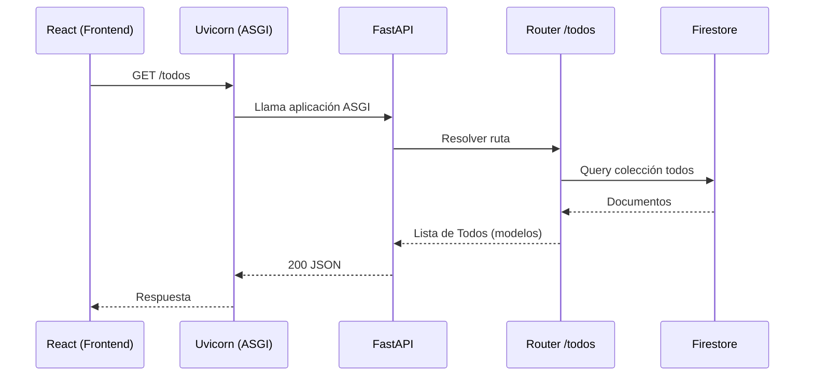

## Flujo de peticiones: Front → Back

### Visión general
- **Cliente (React)** realiza solicitudes HTTP/JSON a la API.
- **CORS** permite el origen del frontend.
- **Uvicorn (ASGI)** recibe la conexión y entrega el `scope` a FastAPI.
- **FastAPI** resuelve la ruta y valida entrada/salida con Pydantic.
- **Router /todos** ejecuta la lógica y accede a datos en **Firestore**.
- **Respuesta JSON** se serializa y se devuelve con código HTTP adecuado.

### Capas y responsabilidades
- **Uvicorn (servidor ASGI)**: transporte y ciclo de vida de la app.
- **FastAPI**: enrutamiento, dependencias, validación y OpenAPI.
- **Modelos Pydantic**: esquemas de entrada/salida (`TodoCreate`, `TodoUpdate`, `Todo`).
- **Router**: orquesta operaciones CRUD.
- **Firestore**: persistencia NoSQL, colección `todos`.
- **Config (pydantic-settings)**: variables de entorno (`.env`).

### Recorrido típico: GET /todos
1. React hace `GET /todos`.
2. CORS autoriza el origen.
3. Uvicorn pasa la petición a FastAPI.
4. FastAPI resuelve `router.get('/')` en `app/routers/todos.py`.
5. `get_firestore_client()` obtiene el cliente.
6. Se consulta `collection('todos').order_by('created_at').stream()`.
7. Se mapea cada documento a modelo `Todo`.
8. Se devuelve `200 OK` con `List[Todo]` en JSON.

### Recorrido: POST /todos
1. React envía JSON con `title`, `description`, `completed`.
2. FastAPI valida con `TodoCreate` (Pydantic). Si falla ⇒ `422`.
3. Se generan `created_at` y `updated_at` (UTC).
4. Se crea documento en Firestore (`document().set(data)`).
5. Respuesta `201 Created` con el `Todo` creado.

### Recorrido: GET /todos/{id}
1. FastAPI extrae `todo_id` de la ruta.
2. Firestore `document(id).get()`.
3. Si no existe ⇒ `404`; si existe ⇒ `200` con el `Todo`.

### Recorrido: PUT /todos/{id}
1. Validación parcial con `TodoUpdate` (campos opcionales).
2. Se construye `updates` y se añade `updated_at` (UTC).
3. `document(id).update(updates)`, respuesta `200` con estado final.

### Recorrido: DELETE /todos/{id}
1. Verificación de existencia del documento.
2. `document(id).delete()`, se devuelve `204 No Content`.

### Diagrama de secuencia (Mermaid)

### Errores y validación
- Entrada inválida (Pydantic) ⇒ `422 Unprocessable Entity` con detalles.
- No encontrado ⇒ `404 Not Found` (`HTTPException`).
- Excepciones no controladas ⇒ `500 Internal Server Error`.

### Configuración y credenciales
- `app/core/config.py` lee `.env` (p. ej. `GOOGLE_APPLICATION_CREDENTIALS`, `GCP_PROJECT_ID`).
- Si no se define `GCP_PROJECT_ID`, el SDK usa credenciales por defecto (ADC).

### Pruebas
- Tests con `pytest` y `httpx` (TestClient).
- Se inyecta un cliente de Firestore falso para simular persistencia.
- Ejecutar: `poetry run pytest -q`.
